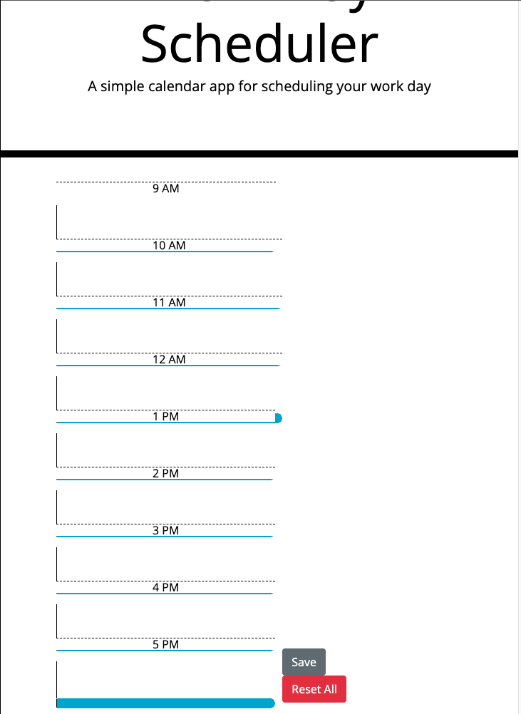

# Workday_Scheduler_JTH

## Description

This is a planner that utilizes local storage to allow the user to save, or delete activities for the time blocks of 9am-5pm

## Table of Contents (Optional)

- [Usage](#usage)
- [Credits](#credits)
- [License](#license)

## Usage

When you open the page, you will see a text box available for the hours of 9am-5pm. You can click into this text box, and enter anything you'd like, and hit the "save" button at the bottom. If you refresh the page, this entry will still be saved into your local storage. To delete any text entries, click the "Reset All" button, and all data will be removed. Deployed page can be accessed here:

## Credits

Template provided by The Ohio State University, completed by myself.

## License

